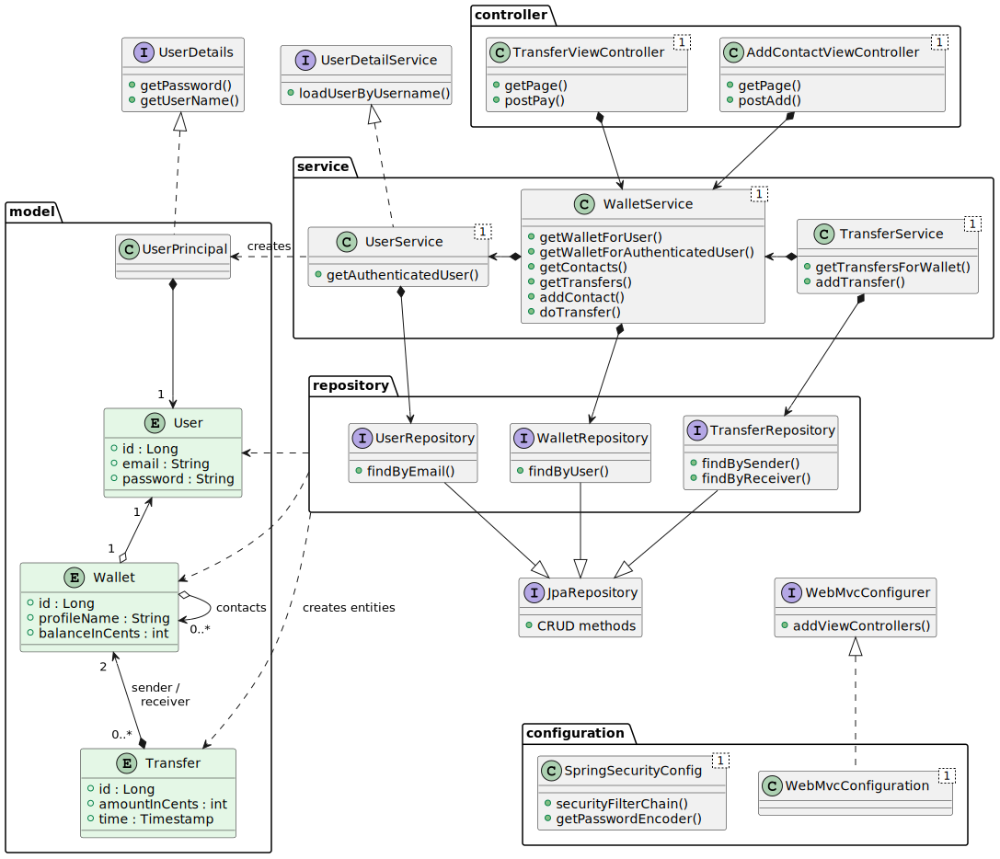

# Pay My Buddy
A prototype of a secure website that allows sending money to other users.

(Project 6 of the Java Course in OpenClassrooms)

## Behaviour

1. Launches a website in localhost:8080
2. Asks for login
3. When authenticated, shows a list of money transfers for the user
4. user can add new contacts and transfer money to them

## Prerequisites

- Java 11

## Class Diagram

## Database structure

