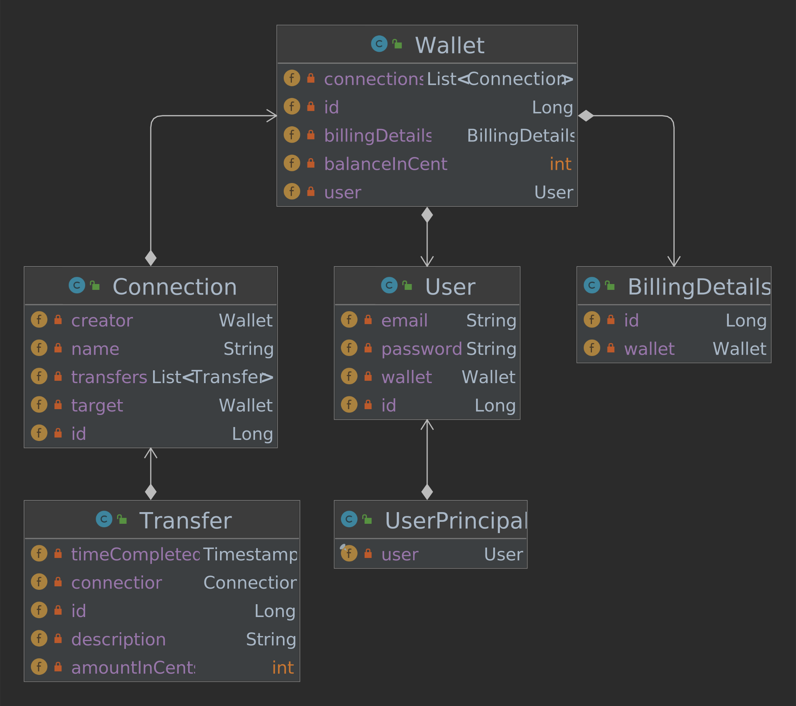
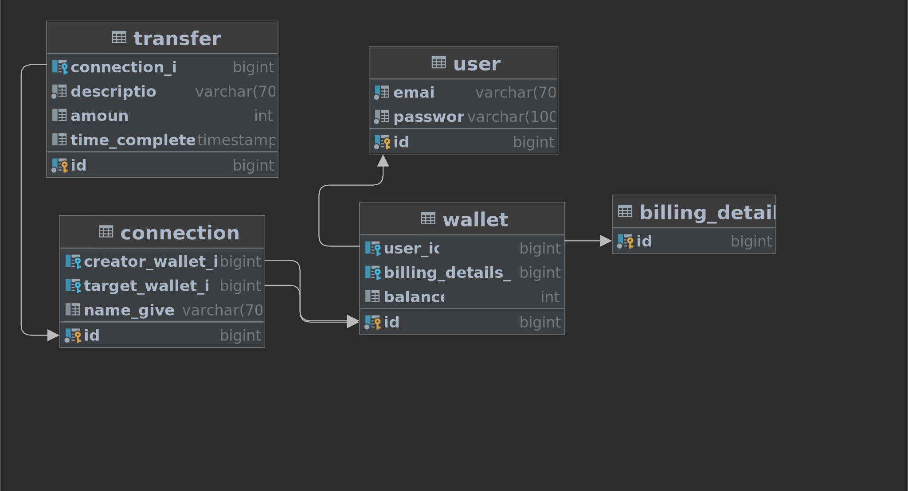

# Pay My Buddy
A prototype of a secure website that allows sending money to other users.

(Project 6 of the Java Course in OpenClassrooms)

## Prerequisites

- Java 11
- MySQL server

## Setup for dev environment

1. Start the MySQL server
2. With a root user, run the SQL commands inside the folder [database-setup](database-setup)
4. Import the app as a Maven project, then `mvn install`
4. Build and run the app

## Diagrams
## A) Class structure (entire app)

## B) Class structure with fields (package "model")

## C) Database Physical model

